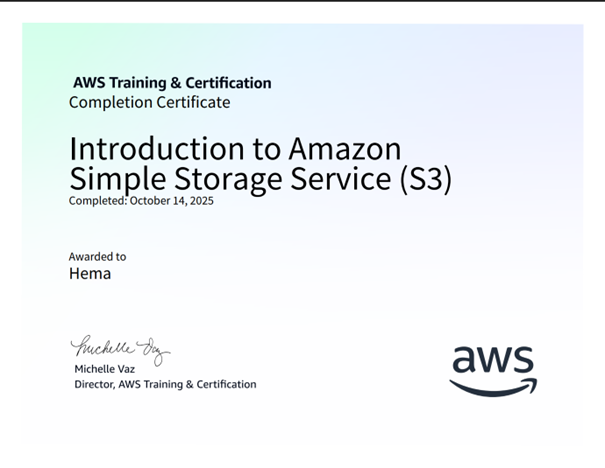

# Week 02 – AWS & Linux Hands-on Labs ☁️🐧  

This week focused on **strengthening AWS foundational skills** through Skill Builder labs and continuing to build **Linux fundamentals** for DevOps using KodeKloud.  
The goal was to reinforce theory from the *AWS Cloud Practitioner Essentials* course and apply it in hands-on environments, developing confidence in both **cloud management** and **system operations**.

---

## 🎯 Learning Goals  
- Practice AWS compute, storage, networking, and security fundamentals (EC2, S3, IAM, VPC, CloudTrail).  
- Reinforce Cloud Practitioner Essentials theory with hands-on labs.  
- Strengthen Linux fundamentals relevant to DevOps (users, permissions, processes, system monitoring).  
- Develop a consistent workflow using both Linux and AWS environments.  

---

## 🧩 Labs & Modules Completed  

| Activity | Description | Status | Evidence |
|-----------|--------------|---------|-----------|
| **Introduction to Amazon EC2 (Lab)** | Learned to launch, connect to, and terminate EC2 instances; explored instance types, AMIs, regions, and security groups. | ✅ Completed |  |
| **Introduction to Amazon S3 (Lab)** | Created S3 buckets, uploaded and versioned objects, configured permissions, and practiced secure data storage. | ✅ Completed |  |
| **Cloud Practitioner Essentials – Module 5: Networking in the Cloud** | Learned VPC, subnets, security groups, and load balancing concepts. Scored **86%** on second assessment attempt after deeper review. | ✅ Completed |  |
| **Cloud Practitioner Essentials – Module 9: Security in the Cloud** | Covered AWS security best practices, IAM, encryption, and shared responsibility model. Achieved **100%** on quiz. | ✅ Completed |  |
| **Introduction to IAM (Lab)** | Created users, groups, roles, and policies. Tested permission boundaries and least privilege access. | ✅ Completed |  |
| **KodeKloud – Linux Basics Course** | Practiced Linux navigation, file management, users, permissions, and processes. Course completion at **51%**. | ✅ In Progress |  |

---

## 🪄 Week 2 Reflection  

Week 2 was a significant step forward in connecting theoretical cloud knowledge with practical, hands-on experience.  
Through AWS Skill Builder labs and Cloud Practitioner Essentials modules, I strengthened my understanding of **compute, storage, networking, and security** fundamentals.  

Revisiting and retaking the **Networking** (Module 5) and **Security** (Module 9) assessments helped deepen my grasp of key AWS concepts — from **VPC architecture** to **IAM best practices** — resulting in improved scores (86% and 100%).  
Completing the **Introduction to IAM** lab reinforced principles of access control and user management, aligning perfectly with DevSecOps practices.

In parallel, I progressed further in the *KodeKloud Linux Basics for DevOps* course (now at **51% completion**), gaining comfort with shell operations, process control, and system monitoring.  
These Linux and AWS foundations are now coming together — providing the necessary base for containerization, CI/CD, and infrastructure automation.

---

✅ **Week 2 complete – AWS & Linux fundamentals solidified.**  
Next → **Week 3: Docker Deep Dive** – containerize a Node.js app, use Docker Compose, and push an image to Docker Hub.

🗓️ *Progress as of 20 October 2025*
